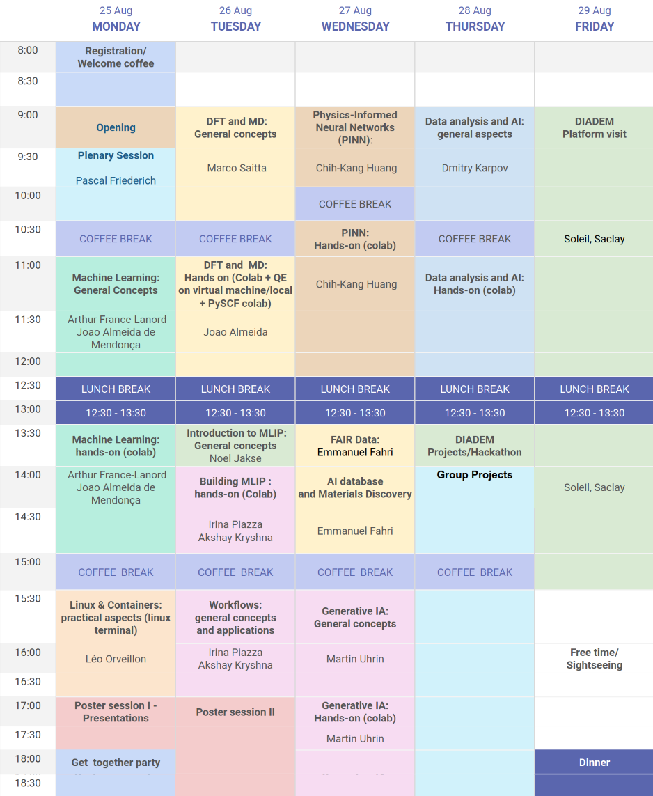

# Resources for DIADEM Summer School 2025

## Introduction

The purpose of this repository is to centralize resources used for the first edition (2025) of the DIADEM summer school, taking place at [Pierre and Marie Curie Campus of Sorbonne University](https://maps.app.goo.gl/U1tsTLtGAPz3XpYi6) from August 25 to 29.

For additional information about the summer school, check the dedicated [website](https://ecolediadem.sciencesconf.org/?lang=en).

## How to contribute

Contribute using github fork/merge capabilities. Here is a quick explanation on how to do so, using github web interface.
If you need any more help, feel free to ask me on slack or by email.

 - Start by forking this repository in your local github space by clicking the "fork" button then "Create fork".
 - Go to the folder of your lecture and add your files and click "Commit changes".
 - Then a "Contribute" button should appear on your main page that allows you to open a pull request.
 - Add a small title and a quick description if you want and click "Create pull request".

Now the modifications just have to be accepted, and it's done. 
